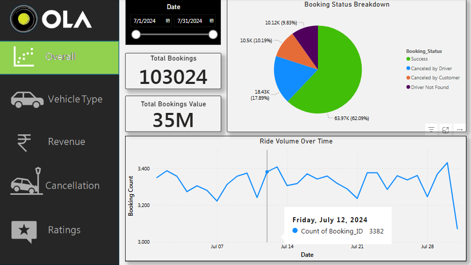
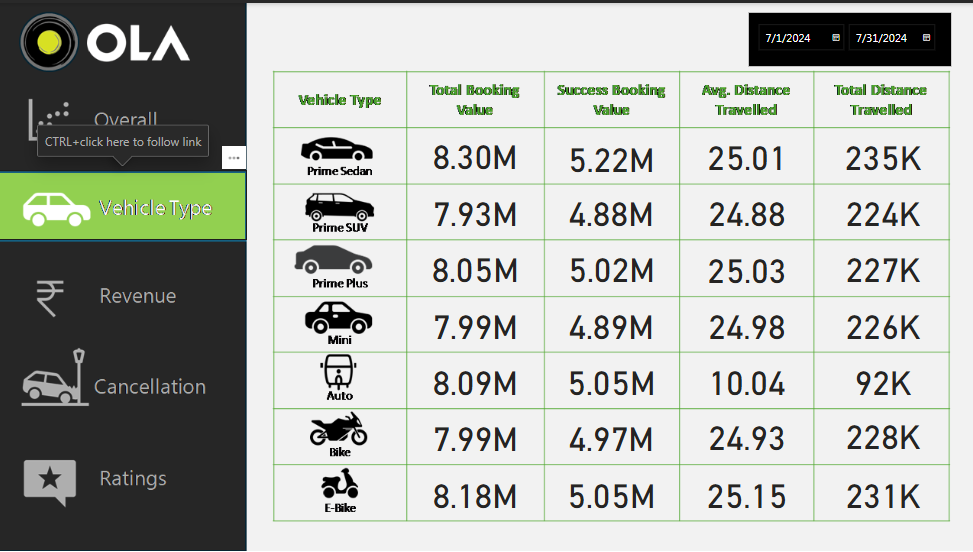
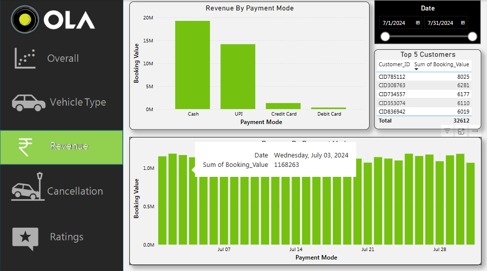
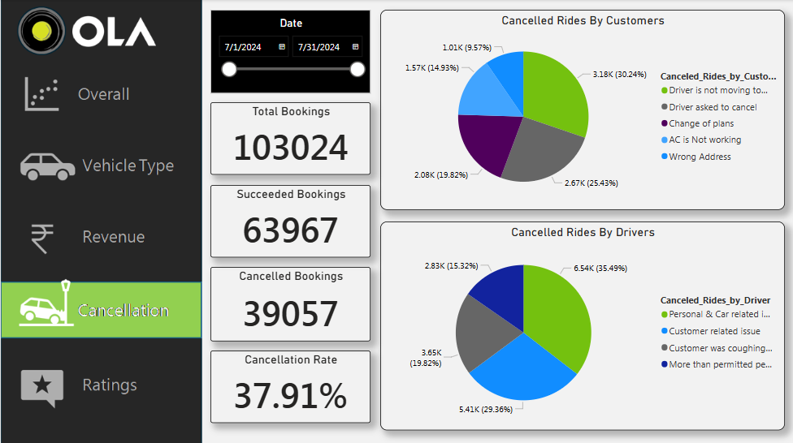
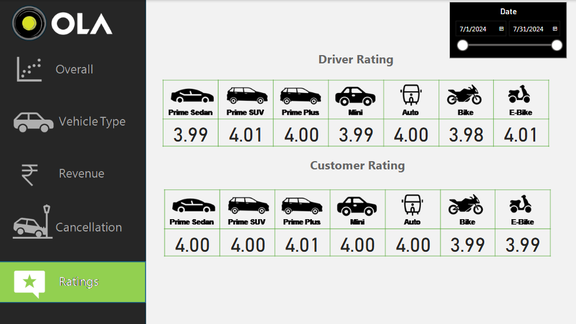

# 🚗 Fleet Management Dashboard – Power BI Project

A dynamic **Fleet Management Dashboard** created using **Microsoft Power BI**, designed to deliver powerful insights into vehicle operations, revenue, customer ratings, and cancellations — all in one place.

---

## 📌 Tools & Technologies

- **Power BI Desktop**: For report building, data visualization, and KPI cards.
- **Power Query**: Used for transforming and cleaning the dataset.
- **DAX**: For creating calculated columns, measures, and custom KPIs.

---

## 📊 Dashboard Insights

### 🔹 Overall Metrics – `Overall.png`

#### ✅ Insights:
- **Total Rides**, **Active Vehicles**, **Total Revenue**, and **Average Rating** all in one frame.
- Key KPIs give a snapshot of the business in real-time.

#### 📈 Charts Used:
- **KPI Cards**: Used to highlight important metrics like total rides, revenue, etc.
- **Bar Chart**: Visualize revenue comparison across months or locations.
- **Line Chart**: Track trends over time (e.g., ride growth or revenue changes).

---

### 🚙 Vehicle Status – `Vechile.png`

#### ✅ Insights:
- Shows vehicle distribution – how many are active, inactive, or under maintenance.

#### 📈 Charts Used:
- **Donut Chart**: To represent vehicle status percentage-wise.
- **Stacked Bar Chart**: Breakdown by city or type for operational decisions.
- **Matrix/Table**: Optional – detailed list of vehicle IDs and statuses.

---

### 💰 Revenue Analysis – `Revenue.png`

#### ✅ Insights:
- Monthly/quarterly revenue performance.
- Total income and growth percentage tracked.

#### 📈 Charts Used:
- **Column Chart**: Compare revenue across months/regions.
- **Card Visuals**: Show total revenue and percentage growth.
- **Area Chart**: Optional to show cumulative revenue trend.

---

### ❌ Cancellation Metrics – `Cancellation.png`

#### ✅ Insights:
- Total cancellation trends.
- Reasons for cancellations with drilldown.

#### 📈 Charts Used:
- **Bar Chart**: Number of cancellations by reason.
- **Line Chart**: Cancellation trend over time.
- **100% Stacked Bar**: Show ratio of cancellation causes across locations.

---

### ⭐ Ratings Overview – `Rating.png`

#### ✅ Insights:
- Shows how customer ratings changed over time.
- Helps identify service quality trends.

#### 📈 Charts Used:
- **Line Chart**: Displays average rating trends over weeks/months.
- **Bar Chart**: Breakdown by driver, city, or category to find patterns.

---

## 📂 Report Structure

The Power BI report includes multiple interlinked pages for comprehensive analysis:

1. **Dashboard Overview** – Quick metrics view (rides, revenue, active vehicles)
2. **Ratings Analysis** – Customer satisfaction trends
3. **Revenue Insights** – Monthly and cumulative income tracking
4. **Vehicle Status** – Fleet management and usage
5. **Cancellations** – Ride failure reasons and service improvement tracking

---

## 🎯 Why These Charts?

| Chart Type         | Purpose                                                                 |
|--------------------|--------------------------------------------------------------------------|
| KPI Cards          | To highlight top-level metrics (rides, revenue, rating, etc.)            |
| Line Chart         | To show time-based trends like ratings, revenue, or cancellations        |
| Bar Chart          | For comparing quantities (e.g., revenue per city, cancellation reasons)  |
| Donut/Pie Chart    | For status distributions (e.g., active vs inactive vehicles)             |
| Area/Column Chart  | For showing cumulative progress or monthly comparisons                   |
| Table/Matrix       | For detailed breakdown of vehicle or ride info (optional)                |

---

## 🧠 Key Learnings

- Hands-on use of **DAX** to calculate KPIs like average ratings, total revenue, and cancellations.
- Used **Power Query Editor** to clean and transform raw datasets before visualization.
- Created **relationships across multiple tables** for accurate and dynamic filtering.
- Designed **interactive visuals** using slicers and filters to improve user experience.
- Gained experience in **storytelling through data** — focusing on clarity and business relevance.

---

## 📥 How to Use

1. Clone/download this repository
2. Open the `.pbix` file in **Power BI Desktop**
3. Update or replace dataset sources if required
4. Use slicers or filters to explore different business insights

## 🤝 Connect With Me

If you liked this project or want to collaborate on Power BI or Data Analysis-related work:

🔗 [LinkedIn – Aditya Kumar Dwivedi](https://www.linkedin.com/in/aditya-kumar-dwivedi-3702552aa/)
